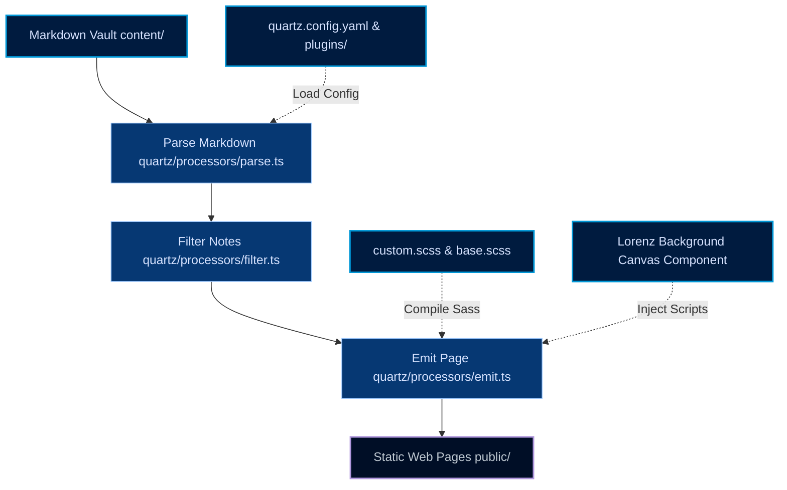
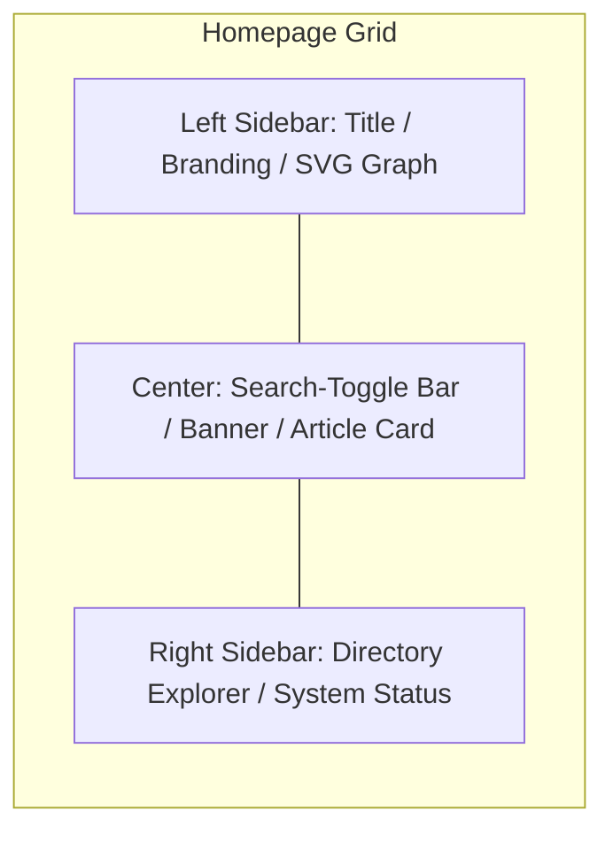

# Repository Report: Digital Garden (Quartz v5)

This repository hosts a highly customized personal digital garden built with **Quartz v5.0.0** (a TypeScript-based static site generator for Markdown notes). The notes are curated from a private Obsidian vault, formatted using an immersive terminal-like design system, and deployed via GitHub Actions to GitHub Pages.

---

## 🏗️ Repository Architecture

Below is the directory structure highlighting key files and their purposes:

* **[quartz.config.yaml](file:///home/shubh/dev/digital-garden/quartz.config.yaml)**: Configuration file detailing general settings (title, base URL, SPA routing, popovers) and the sequential plugin pipeline.
* **[DESIGN.md](file:///home/shubh/dev/digital-garden/DESIGN.md)**: Visual styling guidelines for the "Deep Harbor Garden" theme (navy/cyan/lavender palette, Space Mono headers, Geist content).
* **[quartz/styles/custom.scss](file:///home/shubh/dev/digital-garden/quartz/styles/custom.scss)**: Core stylesheet applying custom glassmorphic properties, the three-column dashboard layout, custom SVG graph styling, and interactive glows.
* **[plugins/lorenz-background/](file:///home/shubh/dev/digital-garden/plugins/lorenz-background)**: Custom local Quartz plugin that imports and registers the interactive canvas component.
* **[quartz/components/LorenzBackground.tsx](file:///home/shubh/dev/digital-garden/quartz/components/LorenzBackground.tsx)**: Preact component containing client-side canvas logic for drawing a simulated Lorenz attractor.
* **[content/](file:///home/shubh/dev/digital-garden/content)**: Folder containing 28 public-safe Markdown pages organized into conceptual subdirectories.
* **[.github/workflows/deploy.yml](file:///home/shubh/dev/digital-garden/.github/workflows/deploy.yml)**: Continuous Integration workflow automating production builds and deployments to GitHub Pages.

### Processing Workflow Diagram

---

## 🎨 Design System: Deep Harbor Garden

The design blends technical documentation style with late-night terminal aesthetics (referred to as the "Control Panel" philosophy).

### Color Palette & Variables
Implemented inside [custom.scss](file:///home/shubh/dev/digital-garden/quartz/styles/custom.scss), the design system includes:
* **Background (`--bg` / `#00132f`)**: Nocturnal navy base.
* **Surface Container (`--surface` / `#001b3f`)**: Near-black navy for cards, code blocks, and panels.
* **Primary Accent (`--primary` / `#0197d6`)**: Technical cyan-blue for headings and active states.
* **Secondary Accent (`--secondary` / `#af96dc`)**: Soft lavender-purple indicating links, tags, and connections.
* **Text (`--on-surface` / `#d7e3ff`)**: High-contrast, reading-friendly light blue-gray.

### Typography
* **Space Mono** (and Iosevka): Used for structural elements, headers, metadata, buttons, code block tags, and status text.
* **Geist** / Default UI: Used for long-form reading in note content to minimize reading fatigue.

### Dashboard Grid Layout
When rendering the home page (`index.md`), Quartz adjusts the grid to a customized 3-column layout:

---

## 🌪️ Lorenz Attractor Background

The repository contains a custom local plugin [lorenz-background](file:///home/shubh/dev/digital-garden/plugins/lorenz-background/index.ts) which injects the interactive [LorenzBackground.tsx](file:///home/shubh/dev/digital-garden/quartz/components/LorenzBackground.tsx) component.

> [!NOTE]
> The **Lorenz attractor** is a system of three ordinary differential equations that displays chaotic behavior when solved for specific parameters.

### Integrator Mechanics
In the client-side script (`afterDOMLoaded`), the component simulates the chaotic system using a fourth-order Runge-Kutta (`rk4`) numerical solver:
$$\frac{dx}{dt} = \sigma(y - x)$$
$$\frac{dy}{dt} = x(\rho - z) - y$$
$$\frac{dz}{dt} = xy - \beta z$$

### Interactive Elements
1. **Interactive Control Panel**: A floating drawer toggleable via a handle. Users can manually shift values for Sigma ($\sigma$), Rho ($\rho$), Beta ($\beta$), and Speed with sliders.
2. **Mouse Responsiveness**: The equations adjust dynamically based on the mouse coordinates relative to the screen size (modulates the effective $\rho$ and $\sigma$).
3. **Motion Trails**: The canvas draws lines that fade slowly into the background color (`#023671` at 8% opacity) rather than clearing the canvas instantly, producing glowing trails.
4. **Color Cycles**: The line colors cycle smoothly through a custom palette `["#f55cad", "#39161f", "#e4467a", "#e79ba8", "#872e4d"]` using linear interpolation (`lerp`).

---

## 📝 Content Vault Structure

The site contains **28 markdown files** organized under `content/` to split notes into clean conceptual boundaries:

| Folder | Pages count | Content Focus |
| :--- | :---: | :--- |
| **[content/projects/](file:///home/shubh/dev/digital-garden/content/projects)** | 10 | Completed/active projects (AI Companion in Go, Rust Unix Shell, Real-Time Audio Visualizer, RAG Assistant, Svelte Blog, etc.). |
| **[content/learning/](file:///home/shubh/dev/digital-garden/content/learning)** | 12 | Trackers/notes on skills like Go, Rust, Machine Learning, Signal Processing, Linux Systems, and Quantum Computing. |
| **[content/ideas/](file:///home/shubh/dev/digital-garden/content/ideas)** | 2 | Rough thoughts/concepts in progress (e.g. Hyprland phone integration). |
| **[content/meta/](file:///home/shubh/dev/digital-garden/content/meta)** | 1 | Meta information including the `Publishing Plan.md`. |
| **[content/logs/](file:///home/shubh/dev/digital-garden/content/logs)** | 1 | Build logs index page. |
| Root | 2 | Homepage ([index.md](file:///home/shubh/dev/digital-garden/content/index.md)) and [About.md](file:///home/shubh/dev/digital-garden/content/About.md). |

---

## 🛠️ Build and Deployment Pipeline

Quartz utilizes standard JS tooling and custom community modules:
* **transpiler/bundler**: `esbuild` compiles TypeScript and SCSS.
* **CSS minifier**: `lightningcss` parses variables.
* **Markup generation**: Unified markdown processor (`remark-parse`, `remark-rehype`, `unified`).
* **CI/CD Workflow**: [deploy.yml](file:///home/shubh/dev/digital-garden/.github/workflows/deploy.yml) triggers on pushes to `main`. It sets up Node 22, runs `npm ci`, downloads Quartz plugins via `npx quartz plugin install`, builds static files into `public/`, and publishes them directly to GitHub Pages.

---

## ⚠️ Known Issues and Recommendations

During analysis, two minor issues were observed:

1. **Prettier Check Warnings**:
   Running `npm run check` reports code style warnings across 8 files:
   * [DESIGN.md](file:///home/shubh/dev/digital-garden/DESIGN.md)
   * [quartz/components/Head.tsx](file:///home/shubh/dev/digital-garden/quartz/components/Head.tsx)
   * [quartz/components/index.ts](file:///home/shubh/dev/digital-garden/quartz/components/index.ts)
   * [quartz/components/LorenzBackground.tsx](file:///home/shubh/dev/digital-garden/quartz/components/LorenzBackground.tsx)
   * [quartz/styles/custom.scss](file:///home/shubh/dev/digital-garden/quartz/styles/custom.scss)
   * Various plugin files.
   
   > [!TIP]
   > Run `npm run format` (which invokes `npx prettier . --write`) to auto-fix these formatting issues before pushing changes to remote.

2. **Publishing Rules Compliance**:
   According to [Publishing Plan.md](file:///home/shubh/dev/digital-garden/content/meta/Publishing%20Plan.md), sensitive folders (`journal/`, `people/`, `todos/`, raw journal texts) must not be published.
   
   > [!IMPORTANT]
   > Ensure that the Obsidian exporter script/sync tool does not copy those folders into `/home/shubh/dev/digital-garden/content`.
